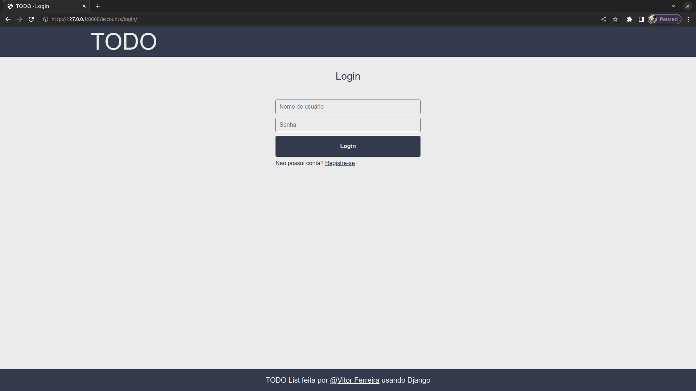
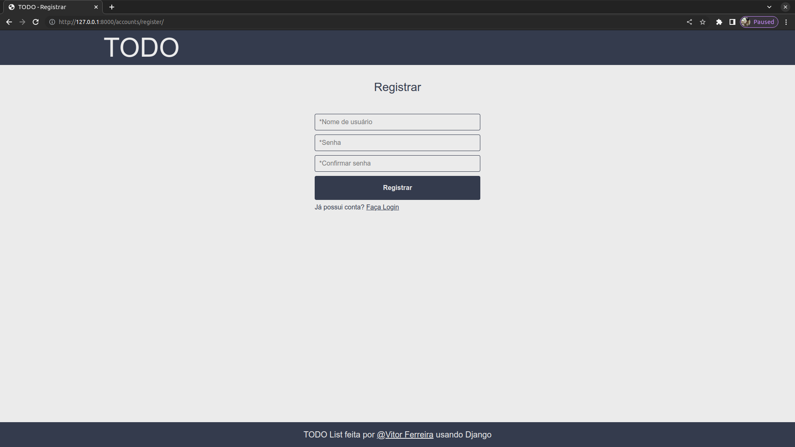
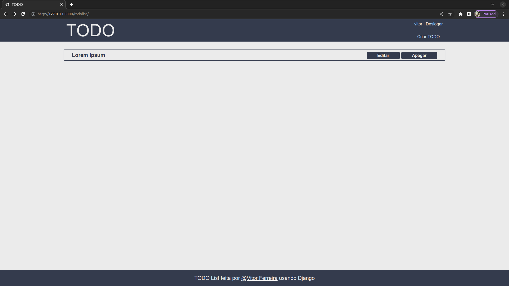
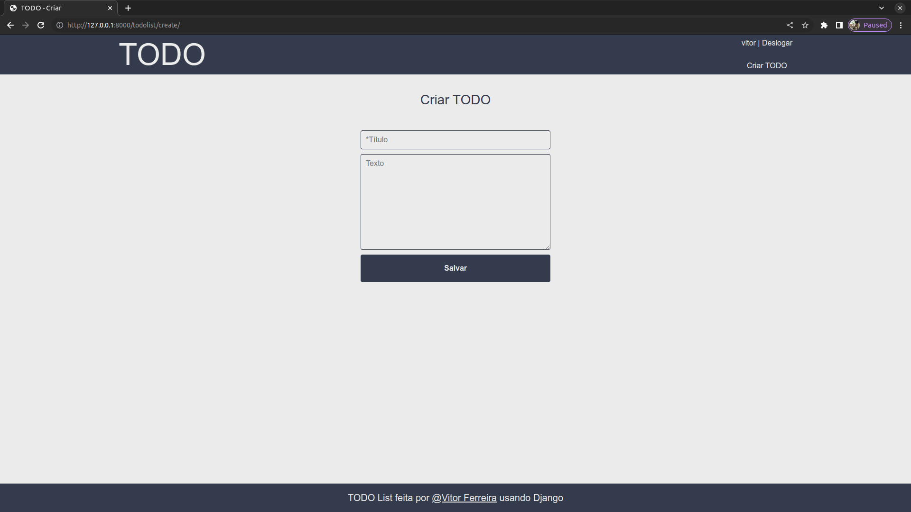
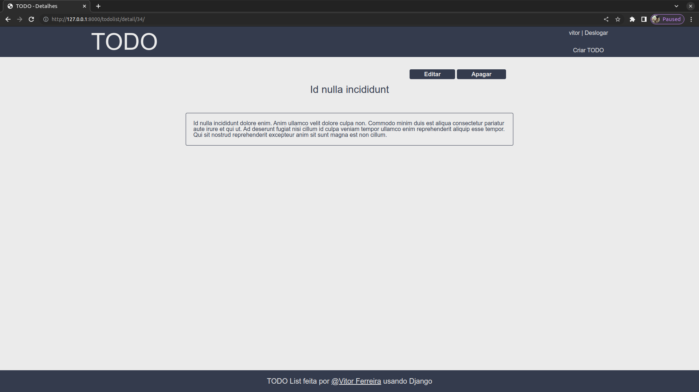
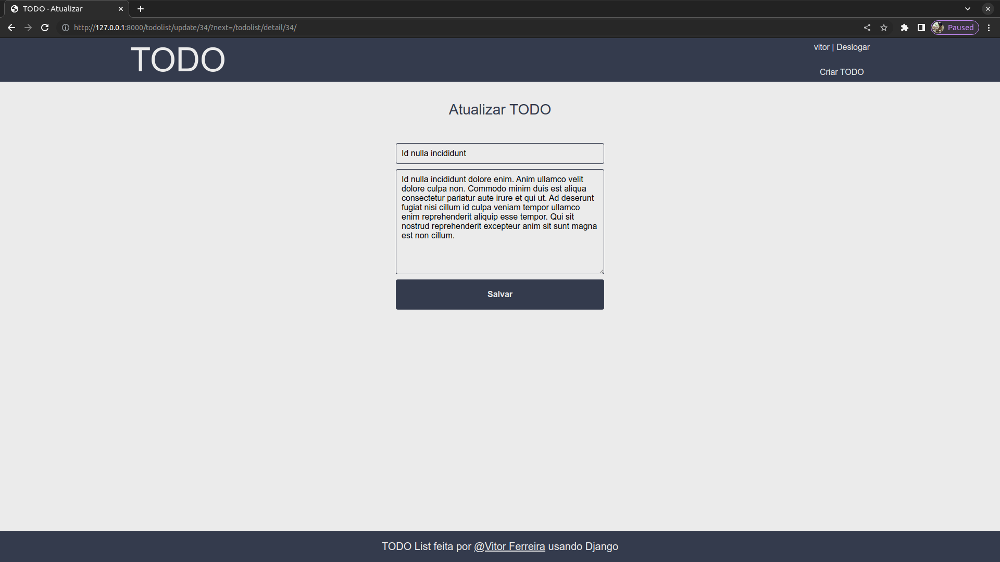
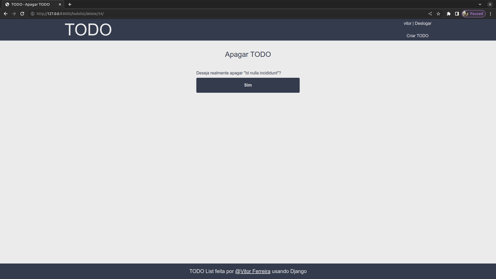

# TODO List

Esse projeto é criado apenas para praticar e aprender mais sobre o Framework Django. Nele eu tento usar ao máximo os recursos que o Django disponibiliza, tentando deixar o código o mais sucinto possível.

Esse app é uma TODO List com sistema de autenticação criada usando Django. Todos os métodos do CRUD são implementados.

## Imagens

### login

### register

### todolist

### todolist create

### todolist details

### todolist update

### todolist delete

